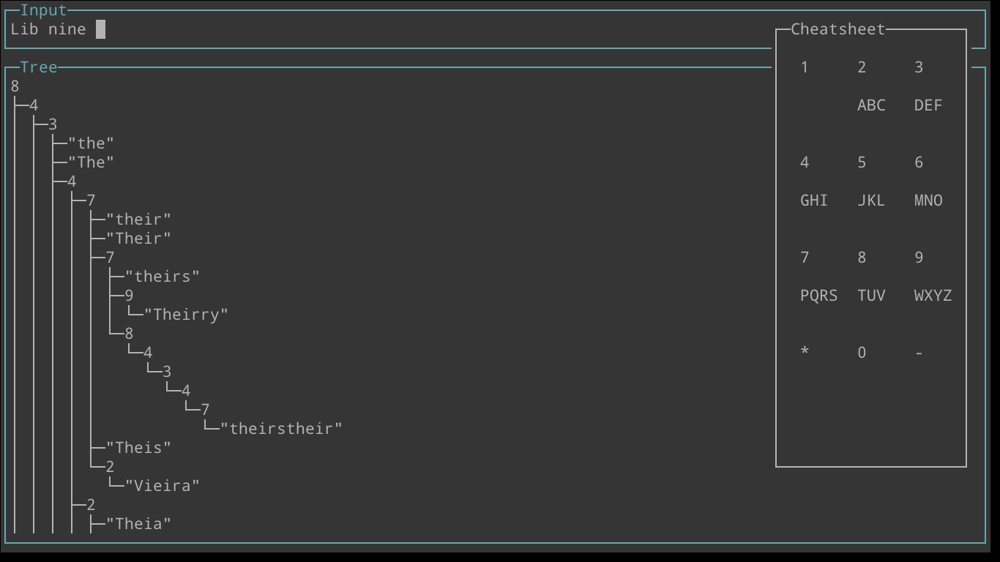

# LibT9
A C library for creating [T9](https://en.wikipedia.org/wiki/T9_%28predictive_text%29) typing systems.



## How to run

### As a Linux Driver
See [driver/](https://github.com/FoxMoss/libt9/tree/main/driver)

### As a Cli Utility
Needs: ncurses & cmake
```
mkdir build
cd build
cmake ..
make -j$(nproc)
cli/main
```

### As a Website
Go to [foxmoss.github.io/libt9/](https://foxmoss.github.io/libt9/)

## Dependencies
None! The library requires nothing but a basic implementation of the C standard
library. The CLI requires ncurses solely, but this is by no means needed to
just compile the library.

## Todo
Feel free to contribute!

- [ ] Punctuation
- [ ] IBus Driver
- [ ] Support for non-words

## Credit
The image used as the background for the web demo was created by Matt Hardy.     
Word data set is from [wortschatz-leipzig.de](https://wortschatz.uni-leipzig.de/en/download/German#deu_news_2024).
The [orignal driver code](https://github.com/chengtaow/Linux-Keyboard-Driver) came from Chengtao Wang.
