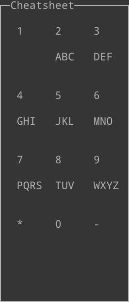

This was based on code written by Chengtao Wang!

## Usage
To run the USB keyboard driver, put usbkbd.c, Makefile in the same folder of the virtual machine.

1) In the folder, type: make
2) Install the module: insmod usbkbd.ko
3) Give the USB keyboard device to the virtual machine.
4) To get the device number, type: dmesg
For my device, I get 1-2:1.0
5) To check the usbhid device: ls -l /sys/bus/usb/drivers/usbhid
6) Unbind the usbhid device and bind the usbkbd device:
echo -n "1-2:1.0" > /sys/bus/usb/drivers/usbhid/unbind
echo -n "1-2:1.0" > /sys/bus/usb/drivers/usbkbd/bind

7) Now we can check our driver.

## Controls

The driver solely relies on your numpad, which has now been fliped (see above).

`0` is for spaces.
`-` is for backspace.
`*` is for cycling through word choices.
